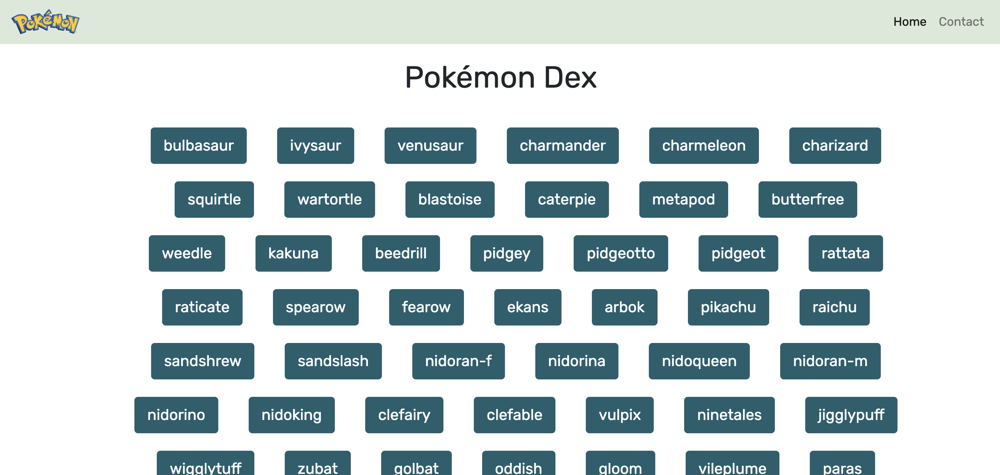
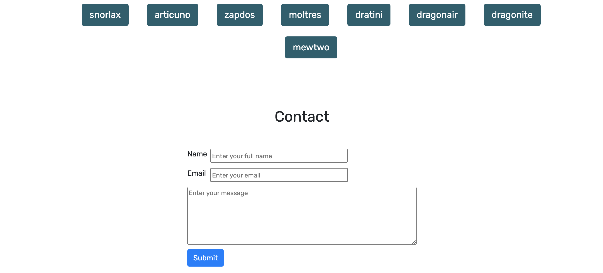
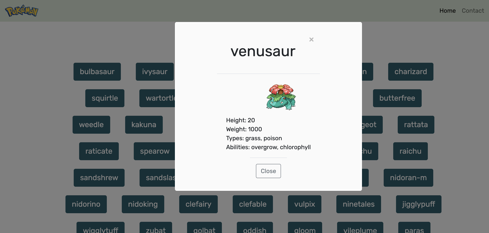

# PokeDex App

The PokeDex App allows the user to select a pokemon name to pull up a modal with each pokemon height, weight, types and a picture. As well as a contact form to send a message. The app was built with Javascript, HTML, CSS and uses an external API.

## Visualization  
### Main page

### Contact 

### Open modal

## Features:

- Pokemon listed as buttons with a modal for each individual item with information from an external API.
- Contact form with name, email, and message input.

## Depencies:

- Fetch polyfill
- Promise polyfill
- Bootstrap

The API used is from https://pokeapi.co/api/v2/pokemon/?limit=150.

The URL for the deployed website is https://madison24.github.io/PokeDex-App/.
